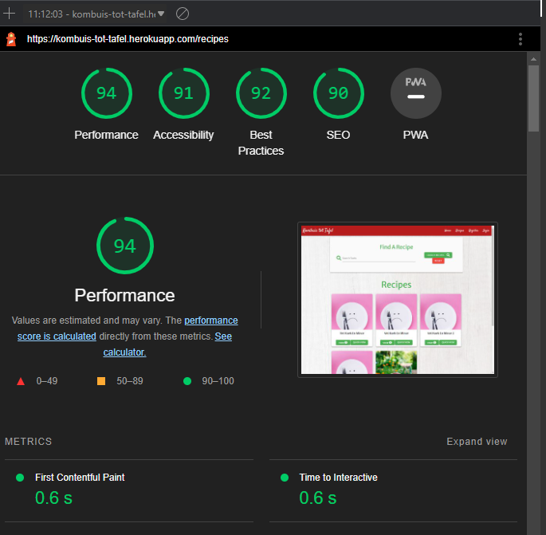

<h1 align="center">Kombuis tot Tafel Website</h1>

# **Kombuis tot Tafel**

View deployed site: [Kombuis tot Tafel](https://kombuis-tot-tafel.herokuapp.com/)

- - -

## **Table of Contents**

1. [UX Development](#ux-development)
    * [PROJECT GOAL](#project-goal)

    * [USER STORIES](#user-stories)
        * [New User](#new-user)
        * [Registered Users/Returning Users](#registered-user-or-returning-users)
        * [Admin User](#admin-user)

    * [DESIGN](#design)
        * [Colour Scheme](#colour-scheme)
        * [Typography](#typography)
        * [Wireframes](#wireframes)
        * [Database Structure](#database-structure)

2. [Features](#features)  
    * [General Features On All Pages](#general-features-on-all-pages)
    * [Features To Implement In Future](#features-to-implement-in-future)

3. [Technology Used](#technology-used)  
    * [Language Used](#language-used)
    * [Frameworks,libraries and Program Used](#frameworkslibraries-and-program-used)

4. [Testing](#testing)

5. [Deployment](#deployment)    

6. [Credits](#credits)  
    * [Content](#content)
    * [Media](#media)  

- - -

## **UX Development**

### **PROJECT GOAL**

The user should easily be able to sreach for a recipe and views the recipe without logging it. The goal is to invite them to sign up and start adding recipes to the site and grow the catalogue long with the community.
On creating an account, a user should be able to perfrom basic CRUD functions (Create, Read, Update, and Delete) and this should be intuitive while having an enjoyable experience

## **User Stories**

### **New User**

* As a first time user, I want to be able to easily navigate the site
* As a first time user, I want to be able to sign up to the site and create a profile
* As a first time user, I want to receive feedback that my profile has successfully been created

### **Registered User/Returning Users**

* As a returning/registered user, I want to be able to log in to my account
* As a returning/registered user, I want to be able to add a recipe
* As a returning/registered user, I want to be able to edit their recipes
* As a returning/registered user, I want to be able to delete their recipes
* As a returning/registered user, I want to be able to print a recipe

### **Admin User**

* As an admin user, I want to be able to add, edit or delete categories.
* As an admin user, I want to be able to add, edit or delete account types.
* As an admin user, I want to be able to add, edit or delete users.

## **Design**

### **Colour Scheme**

After some reseach, i found many sites use shades of red, white and green for food websites. I originally wanted to use the colours of the South African flag but settled on 3 of the colours after the research. These are the colours choosen:

### **Typography**

As the main focus of the site is the messages that people are sending, we have only used one font throughout the site to prevent users becoming overwhelmed.

Quicksand was imported from google fonts. It is a sans-serif font which is accessible friendly.

For Logo, Navbar and Footer font:

Font body text:

### **Wireframes**

The entire site's wireframe was done using [Balsamiq](https://balsamiq.com/).
Both wireframs from Desktop and mobile have been added:

+ Home page

+ Login/Register

+ Profile Page

+ Add/Edit Recipe Page

+ Add/Edit Users Page

+ Recipes Page

### **Database Structure**

MongoDB was chosen as the non relational database for this project due to the flexibility and ease of use to edit data if needed. The recipes all are saved in mongoDB

I chose to use SQLAlchemy to manage the USer, Categories and Accounts as they are more structured and easier to maintain in the relational database

## **Features**

### **General Features On All Pages**

The site has been designed to be fully responsive, from mobile all the way up to desktop.

#### **Navbar**

The site has a fully responsive navbar.

#### **Footer**

The site has a fully responsive footer. The footer contains links to social media, the privacy policy and terms and conditions pages. It also features a call to action button asking users to join now.

#### **Favicon**

The Favicon was created using [Free Logo Design](https://www.freelogodesign.org/).
We have chosen this image as our site logo and have also used it as our favicon.

####  **Site Logo**

We have chosen this image as our site logo as it is simple yet effective on what we do.
I chose to remove the logo in the end due to sizing issues and time constraints.

### **Features To Implement In Future**
* I add authentication to the site even though it was not neccessary but I felt that it need to be almost as correct as possible. Due to time contrainst on the project, I repeated the code a bit. I look to implement a "DON'T REPEAT YOURSELF" approach in future.

* I want to further expand on the Admin features by implementing an assign feature to category removal so recipes do not have to be fully deleted. I left the cascade function for the purpose of the project but that will change to a choice in future.
* This is the same with user deletions, there will be a choice on delete all recipes or assign to "Admin"

## **Technology Used**

### **Language Used**

HTML, CSS, Javascript, Python, Materialize, Heroku

### **Frameworks, libraries & Program Used**

* [Balsamiq](https://balsamiq.com/) - To create wireframes.
* [Git](https://git-scm.com/) - For version control.
* [Github](https://github.com/)- To save and store the files for the website.
* [Jinja](https://jinja.palletsprojects.com/en/3.1.x/) - Templating engine
* [Materialize 1.0.0](https://materializecss.com/) - Used as CSS Framework
* [Fontawesome](https://fontawesome.com/) - Used for the sites iconography
* [Google DevTools](https://developers.google.com/web/tools) - To troubleshoot and test features, solve issues with responsiveness and styling.
* [Am I Responsive?](http://ami.responsivedesign.is/) To show the website image on a range of devices.
* [Heroku](https://www.heroku.com/) To deploy the project.
* [Flask](https://pypi.org/project/Flask/) - Web Application Framework
* [MongoDB](https://www.mongodb.com/) - Non Relational Database
* [SQLAlchemy](https://www.sqlalchemy.org/) - Relational Database
* [Google fonts](https://fonts.google.com/) - used to import the font used on the site.
* [Unsplash](https://unsplash.com/) - used to for the images.

## **Testing**

Tools used to test site:
+ [W3C HTML Validation Service](https://validator.w3.org/ "W3C HTML")
    
+ [W3C CSS Validation Service](https://jigsaw.w3.org/css-validator/ "W3C CSS Result")
    
+ [JSHint](https://jshint.com/ "JSHint")
    
+ [PEP8](http://pep8online.com/ "PEP8") - Zero error - Results found here [PEP8 Results](/kombuistottafel/documentation/testing/ "PEP8")
+ Lighthouse General Mobile
    

        
    
        
    

+ Lighthouse General Desktop
        
        
      

### **Additional Testing**
* On testing the app on HEROKU, i found the images caused the site performance to be really slow. I had to reduce all the images and it vastly imporoved the performance.

### **Bugs**
* On smaller deviced the hero image does not stretch to the end.
* Modals from materialize cause the screen to "pop", and i could not fix that. Some of my testers did not notice it until I mentioned it. Future fix

## **Deployment**

### **Deployment Heroku**

This project was deployed using Heroku:

1. Create a new app with the name kombuis_tot_tafel.
2. Link the kombuis_tot_tafel app to its Github repository.
3. Verify that the project has an up to date Procfile and requirements.txt
4. Push the project to the Heroku remote.
5. Add PostGres to Heroku
6. Create Database
7. Set the SECRET_KEY environmental variable in the Heroku config vars.
8. Set the IP to 0.0.0.0 and the PORT to 5000 in the Heroku config vars.
9. Set the MONGO_URI environmental variable in the Heroku config vars.
10. Set the PostGres URL environmental variable in the Heroku config vars.
11. Restart all dynos.
12. Open the app on Heroku and check to ensure that it's working correctly.
13. Create Admin user on DB to "close" access to admin profile.

### **How to clone**

1. Under the repository name on GitHub, click Clone or download.
2. In the Clone with HTTPs section, click the icon beside the URL to copy the clone URL for the repository.
3. Change the current working directory to the location where you want the cloned directory to be made.
4. Type git clone, and then paste the URL you copied in Step 2.
5. Press Enter. Your local clone will be created.
6. Set up a virtual environment.
7. Install the packages in requirements.txt by typing pip3 install -r requirements.txt in the CLI.
8. Create env file with the following:
    + import os
    + os.environ.setdefault("IP", "0.0.0.0")
    + os.environ.setdefault("PORT", "5000")
    + os.environ.setdefault("DEBUG", "True")
    + os.environ.setdefault("DEVELOPMENT", "True")
    + os.environ.setdefault("SECRET_KEY", "any_key")
    + os.environ.setdefault("MONGO_URI", "mongodb_uri")
    + os.environ.setdefault("MONGO_DBNAME", "kombuis_tot_tafel")
    + os.environ.setdefault("DB_URL", "postgresql:///kombuistottafel")

### **How to Fork**

To fork the repository:

Log in (or sign up) to Github.
Go to the repository for this project, [Kombuis tot Tafel]()
Click the Fork button in the top right corner.

## **Credits**
For code inspiration, help and advice. Thank you!

* Used the Flask mini project from Code Institute as a main template to the project
+ [Simen Daehlin](https://github.com/Eventyret "Simen Daehlin") - Code Institute Mentor.
+ [Martina Terlevic](https://www.linkedin.com/in/martinaterlevic/ "Martina Terlevic") - Code Institute Mentor.
+ [Christopher Rees](https://portfolio.christopher-rees.co.uk/ "Christopher Rees") - Colleague, friend and motivator.
+ [Kera Cudmore](https://github.com/kera-cudmore "Kera Cudmore") - README Template help.
+ [StackOverFlow](https://stackoverflow.com "Stackoverflow Theme Solution") - Stackoverflow general Solutions
+ [W3 Schools](https://www.w3schools.com/ "W3 Schools") - Code reference

### **Media**

* [Home Page](kombuistottafel/documentation/responsive_home.png)  

      

* [Login Page ](kombuistottafel/documentation/login_page.png)

    

* [View Recipe Page Hero](kombuistottafel/documentation/view_recipe_page.png)

  

* [Admin Settings Page](kombuistottafel/documentation/admin_settings_page.png)

    

* [Profile Page](kombuistottafel/documentation/profile_page.png)

    

